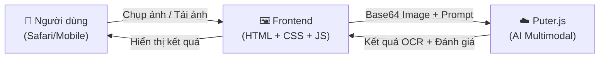
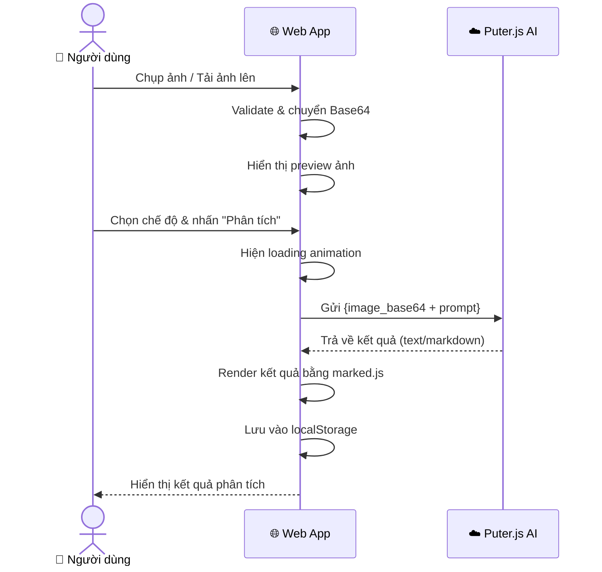

# Ứng dụng Web Đọc Chữ Từ Hình Ảnh Bằng AI

Xây dựng ứng dụng web **đọc chữ từ hình ảnh (OCR) + đưa ra đánh giá** sử dụng **Puter.js** – hoàn toàn miễn phí, không cần API key, không cần backend.

## Tổng Quan Kiến Trúc



### Công nghệ sử dụng

| Thành phần | Công nghệ | Lý do |
|---|---|---|
| **AI Engine** | Puter.js (`puter.ai.chat()`) | Miễn phí, không cần API key, hỗ trợ multimodal (ảnh + text) |
| **AI Model** | `claude-sonnet-4-20250514` hoặc `gpt-4o` (qua Puter.js) | Hỗ trợ vision/multimodal, đọc tiếng Việt tốt |
| **Frontend** | HTML5 + Vanilla CSS + JavaScript | Đơn giản, tương thích Safari iOS |
| **Camera** | HTML5 `<input type="file" capture="environment">` | Hỗ trợ chụp ảnh trực tiếp trên iOS Safari |

> [!IMPORTANT]
> **Không cần backend, không cần server, không cần API key.** Toàn bộ ứng dụng chạy trên trình duyệt. Puter.js xử lý gọi AI miễn phí.

## User Review Required

> [!IMPORTANT]
> **Chế độ phân tích:** Hiện tại plan thiết kế 3 chế độ:
> 1. **📝 Trích xuất văn bản** – chỉ đọc chữ từ ảnh (OCR thuần túy)
> 2. **📊 Đánh giá văn phong** – đọc chữ + nhận xét chất lượng văn bản  
> 3. **🔍 Phân tích chi tiết** – đọc chữ + phân tích ngữ cảnh, ngữ pháp, cấu trúc
> 
> Bạn muốn giữ cả 3 hay thêm/bớt chế độ nào?

> [!NOTE]
> **Ngôn ngữ giao diện:** Giao diện sẽ được thiết kế bằng **tiếng Việt** để phù hợp với người dùng Việt Nam.

## Open Questions

> [!IMPORTANT]  
> **Tên ứng dụng:** Tôi dự định đặt tên là **"Máy Chấm Bài"** (dựa theo tên thư mục `maychambai`). Bạn muốn tên khác không?

> [!NOTE]
> **Mô hình AI:** Puter.js hỗ trợ 400+ mô hình. Tôi sẽ mặc định dùng `claude-sonnet-4-20250514` (phân tích ảnh tốt, hỗ trợ tiếng Việt). Bạn muốn cho phép người dùng tự chọn model không?

---

## Proposed Changes

### Frontend – Giao diện người dùng

Thiết kế **mobile-first**, tối ưu cho Safari iOS, với giao diện dark-mode premium.

#### [NEW] [index.html](file:///c:/Users/VIEN%20THONG/Desktop/maychambai/index.html)

Cấu trúc HTML chính:
- **Header**: Tên app + tagline
- **Upload Zone**: Khu vực chụp ảnh / tải ảnh lên (drag & drop trên desktop, nút chụp trên mobile)
- **Preview**: Hiển thị ảnh đã chọn với khả năng zoom
- **Mode Selector**: 3 nút chọn chế độ phân tích
- **Custom Prompt (optional)**: Ô nhập yêu cầu tùy chỉnh (vd: "Chấm bài viết này theo thang 10")
- **Action Button**: Nút "Phân tích" kích hoạt AI
- **Results Panel**: Khu vực hiển thị kết quả với markdown rendering
- **History**: Lịch sử phân tích gần đây (lưu localStorage)

Thư viện bên ngoài (qua CDN):
- `Puter.js` – SDK gọi AI miễn phí
- `marked.js` – render markdown từ kết quả AI
- Google Fonts `Inter` – typography hiện đại

---

#### [NEW] [styles.css](file:///c:/Users/VIEN%20THONG/Desktop/maychambai/styles.css)

Design system:
- **Color palette**: Dark theme với gradient tím-xanh (purple → cyan)
- **Typography**: Inter font, responsive sizing
- **Layout**: CSS Grid + Flexbox, mobile-first breakpoints
- **Components**: 
  - Glassmorphism cards (`backdrop-filter: blur()`)
  - Pulse animation cho loading state
  - Smooth slide-up cho kết quả
  - Glow effects cho các nút interactive
- **Safari iOS fixes**:
  - `-webkit-backdrop-filter` 
  - `env(safe-area-inset-*)` cho notch
  - `-webkit-overflow-scrolling: touch`
  - `touch-action: manipulation` (tránh double-tap zoom)

---

#### [NEW] [app.js](file:///c:/Users/VIEN%20THONG/Desktop/maychambai/app.js)

Logic chính:

```
1. Image Input Handler
   ├── Nhận file từ <input> (camera hoặc gallery)
   ├── Validate kích thước (max 10MB)
   ├── Chuyển sang Base64 bằng FileReader
   └── Hiển thị preview

2. AI Analysis Engine
   ├── Xây dựng prompt dựa trên chế độ đã chọn
   ├── Gửi request multimodal đến Puter.js:
   │   puter.ai.chat([{
   │     role: "user",
   │     content: [
   │       { type: "text", text: prompt },
   │       { type: "image_url", image_url: { url: dataURI } }
   │     ]
   │   }], { model: "claude-sonnet-4-20250514" })
   ├── Streaming response (nếu hỗ trợ)
   └── Render kết quả bằng marked.js

3. History Manager
   ├── Lưu kết quả vào localStorage
   ├── Hiển thị danh sách lịch sử
   └── Xem lại / xóa lịch sử

4. UX Utilities
   ├── Loading animation + progress indicator
   ├── Error handling với thông báo rõ ràng
   ├── Copy kết quả vào clipboard
   └── Responsive adjustments
```

**Các prompt mẫu cho từng chế độ:**

| Chế độ | Prompt gửi đến AI |
|---|---|
| Trích xuất văn bản | "Hãy trích xuất toàn bộ văn bản có trong hình ảnh này. Giữ nguyên định dạng và cấu trúc gốc." |
| Đánh giá văn phong | "Hãy trích xuất văn bản trong ảnh, sau đó đánh giá văn phong: tính chuyên nghiệp, ngữ pháp, cách dùng từ." |
| Phân tích chi tiết | "Hãy trích xuất văn bản trong ảnh và phân tích chi tiết: ngữ pháp, cấu trúc câu, logic, mạch lạc, và đưa ra điểm số tổng thể /10." |

---

## Luồng Hoạt Động Chi Tiết



---

## Verification Plan

### Automated Tests
- Mở trực tiếp file `index.html` trong trình duyệt (không cần server)
- Kiểm tra giao diện responsive bằng DevTools (iPhone SE, iPhone 14, iPad)
- Test chụp ảnh và phân tích trên Safari iOS thật (nếu có)

### Manual Verification
- **Upload ảnh**: Kiểm tra upload từ gallery và chụp trực tiếp
- **OCR**: Upload ảnh có chữ tiếng Việt, kiểm tra kết quả trích xuất
- **Đánh giá**: Kiểm tra AI đưa ra nhận xét có ý nghĩa
- **Responsive**: Kiểm tra giao diện trên cả mobile và desktop
- **Safari compatibility**: Kiểm tra glassmorphism, animations, camera capture

---

## Cấu Trúc File Cuối Cùng

```
maychambai/
├── index.html      ← Trang chính (load CSS, JS, Puter.js, marked.js)
├── styles.css      ← Design system + responsive styles
└── app.js          ← Logic xử lý ảnh, gọi AI, quản lý lịch sử
```

> [!TIP]
> Ứng dụng có thể mở trực tiếp bằng cách double-click `index.html` – không cần cài đặt server. Để dùng trên điện thoại, chỉ cần host lên GitHub Pages hoặc Puter Hosting (miễn phí).
